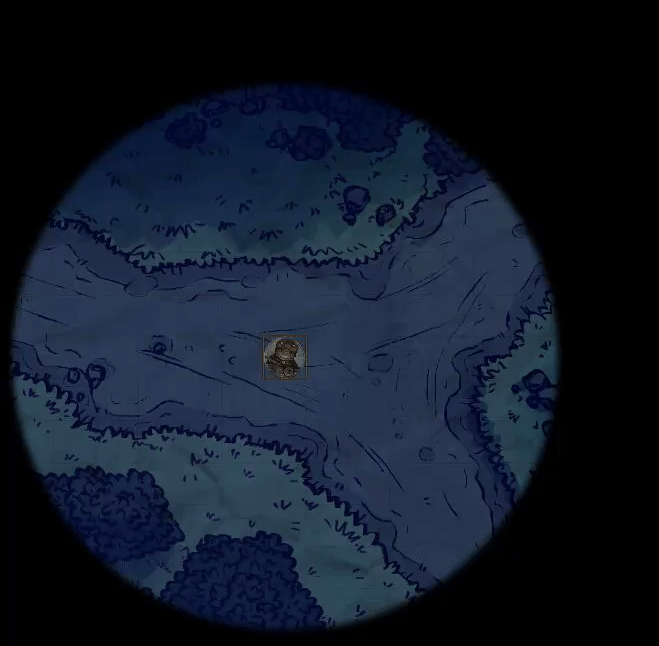
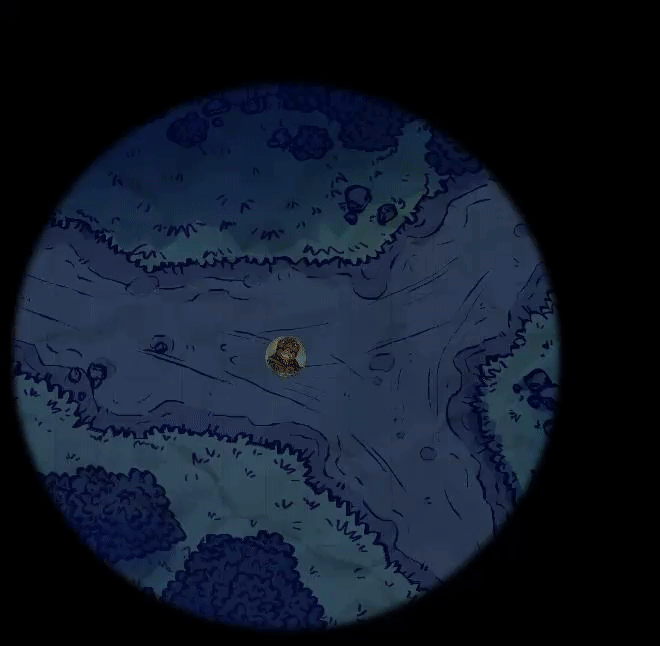
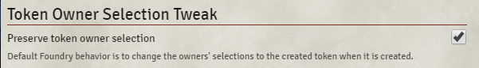

# Token Owner Selection Tweak


This is a tiny tweak aimed at solving a single inconvenience. If you're the kind of DM who likes using independant tokens for Light Sources or Spell Effects, you might have noticed that when you create such a token, all players who "Own" that character immediately select the new token.

This creates confusion as the players try to realize why the whole map just went dark and it would be easier to not have to repeat "deselect whatever token you have selected."

### Foundry Default Behavior


### With this module's tweak


## Solution

> Do not modify player selections when a new token is created that they own.

## Installation

Module json: 

```
https://github.com/ElfFriend-DnD/foundryvtt-tokenOwnerSelectionTweak/releases/latest/download/module.json
```

Once installed and activated, there is a setting under Module Settings:


## Future plans
Allow for two possible solutions (module options) with the other being:
> Allow vision based on all owned character tokens while any are selected.

## Acknowledgements

Bootstrapped with Nick East's [create-foundry-project](https://gitlab.com/foundry-projects/foundry-pc/create-foundry-project).
